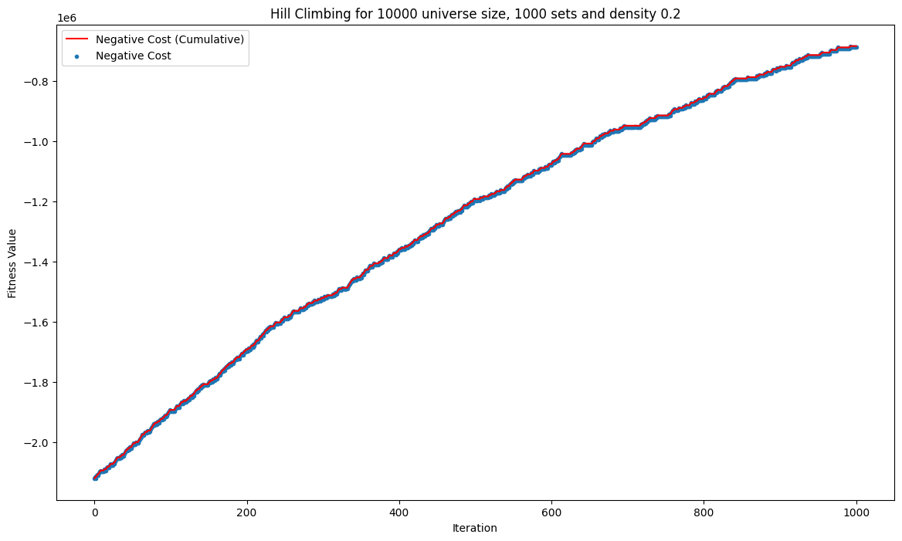
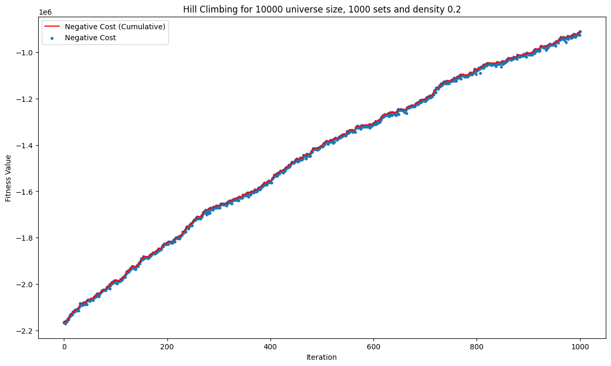
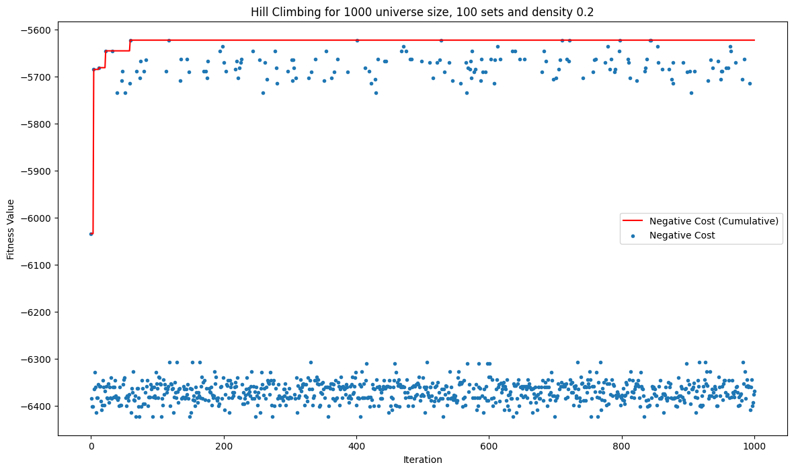
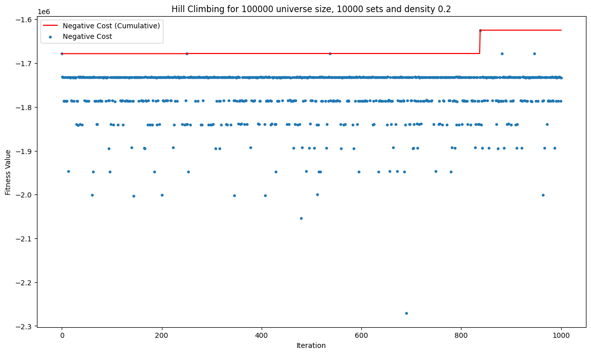
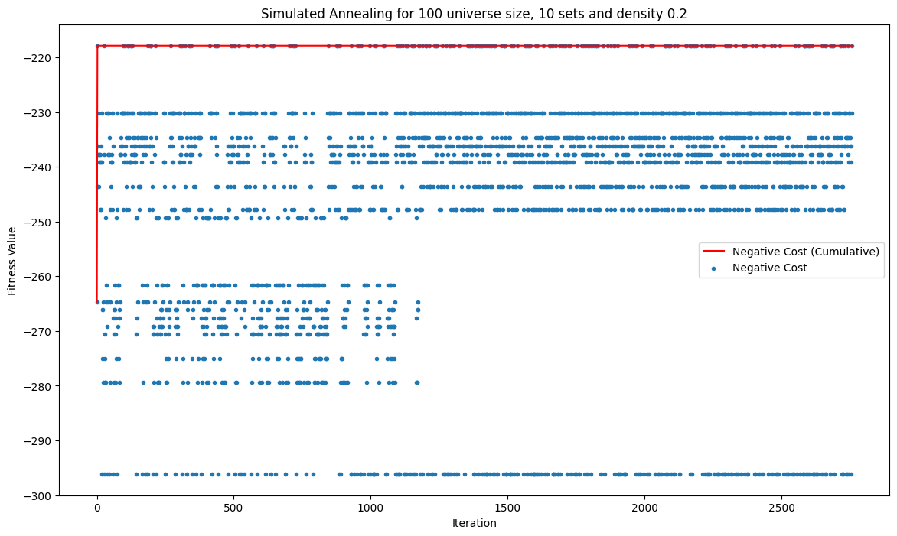
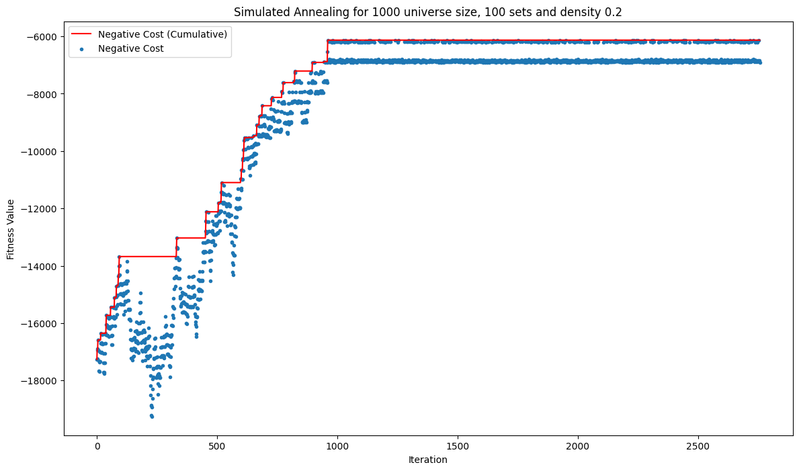

#### Andrea Zenotto - s327473

---

# Lab 1: Set Cover Problem

In this implementation, we tackle the Set Cover Problem using various optimization strategies, specifically Hill Climbing and Simulated Annealing. This problem involves selecting a subset of sets that collectively cover all elements in a given universe while minimizing the associated costs. Below is a detailed breakdown of the various components of the code, including the functions used and the hyperparameters chosen.

## 1. Problem Setup

### Universe and Parameters

The problem is defined over several instances with varying parameters:

- **`UNIVERSE_SIZE`**: This list specifies different sizes for the universe, with values `[100, 1000, 10000, 100000, 100000, 100000]`. 
- **`NUM_SETS`**: This indicates how many sets will be generated for each instance, corresponding to the universe sizes.
- **`DENSITY`**: This parameter defines the density of the coverage matrix, influencing how many elements each set is likely to cover.

The intention behind these parameters is to analyze how the algorithm performs as the complexity of the problem increases.

## 2. Function Definitions

### Validity Check

The `valid` function checks whether a given solution covers all elements of the universe. It does this by applying a logical OR operation across the sets indicated by the solution's boolean values. This ensures that every element in the universe is covered by at least one selected set.

```python
def valid(SETS, solution):
    return np.all(np.logical_or.reduce(SETS[solution]))
```

### Cost Calculation

The `cost` function computes the total cost of a solution. It sums up the costs associated with the sets that are included in the current solution.

```python
def cost(COSTS, solution):
    return COSTS[solution].sum()
```

### Fitness Evaluation

The `fitness` function evaluates a solution's quality. It returns a tuple where the first element indicates whether the solution is valid and the second element is the negative cost (to be maximized during optimization).

```python
def fitness(instance, solution):
    (SETS, COSTS) = instance
    return (valid(SETS, solution), -cost(COSTS, solution))
```

### Data Generation

The `generate_sets_and_costs` function creates random sets and costs based on specified parameters. It generates a boolean matrix representing which sets cover which elements, ensuring every element is covered by at least one set.

```python
def generate_sets_and_costs(UNIVERSE_SIZE, NUM_SETS, DENSITY):
    SETS = np.random.random((NUM_SETS, UNIVERSE_SIZE)) < DENSITY
    # Ensure coverage of all elements...
```

### Random Solution Generation

The `generate_starting_solution` function generates a valid starting solution for the optimization process. It ensures that the randomly generated solution covers all elements in the universe.

```python
def generate_starting_solution(i, instance):
    solution = np.random.random(NUM_SETS[i]) < 0.5
    while not valid(instance[0], solution):
        solution = np.random.random(NUM_SETS[i]) < 0.5
    return solution
```

### Fitness History Visualization

The `plot_fitness` function visualizes the fitness history of the optimization process, allowing us to see how the fitness of the solution evolves over iterations.

```python
def plot_fitness(history, title): 
    plt.figure(figsize=(14, 8))
    plt.plot(range(len(history)), list(accumulate(history, max)), color="red", label="Negative Cost (Cumulative)")
    ...
```

## 3. Optimization Strategies

### Hill Climbing

The Hill Climbing algorithm iteratively refines the solution by generating neighboring solutions and selecting the one with the highest fitness. The `hill_climber` function implements this strategy, accepting a tweak function (either `single_mutation` or `multiple_mutations`) that determines how neighbors are generated.

```python
def hill_climber(i, instance, tweak, starting_solution, MAX_STEPS):
    ...
```

**Mutation Approaches**:
- **Single Mutation**: This method randomly flips a single boolean value in the solution.
- **Multiple Mutations**: This variant continues flipping values until a certain condition is met, allowing for more substantial changes to the solution.

### Greedy Solution

A greedy algorithm is also implemented to generate an initial solution. It selects sets that cover the most uncovered elements in each iteration until all elements are covered.

```python
def greedy_solution(i, instance):
    ...
```

### Simulated Annealing

Simulated Annealing is another optimization approach used in this implementation. The `simulated_annealing` function incorporates temperature parameters that control the acceptance of worse solutions. This allows the algorithm to escape local optima by occasionally accepting solutions that are not immediately better.

```python
def simulated_annealing(i, instance, tweak, starting_solution, initial_temp, final_temp, alpha):
    ...
```

**Hyperparameters**:
- **`initial_temp`**: Starting temperature of 1000, which influences the likelihood of accepting worse solutions.
- **`final_temp`**: Stopping temperature of 0.001, below which the algorithm ceases to operate.
- **`alpha`**: Cooling factor set to 0.995, which gradually lowers the temperature throughout the iterations.

## 4. Execution and Results

### 1. Hill Climbing with Single Mutation

| Instance | Universe Size | Number of Sets | Density | Best Solution |
|----------|---------------|----------------|---------|---------------|
| 1        | 100           | 10             | 0.2     |    254.888    |
| 2        | 1000          | 100            | 0.2     |   7305.568    |
| 3        | 10000         | 1000           | 0.2     |      684023.374         |
| 4        | 100000        | 10000          | 0.1     |    115637752.605           |
| 5        | 100000        | 10000          | 0.2     |     244478913.435          |
| 6        | 100000        | 10000          | 0.3     |      378439450.655         |

|  |  |
|-----------------------------|-----------------------------|
|  |  |
|  |  |

---

### 2. Hill Climbing with Multiple Mutations

| Instance | Universe Size | Number of Sets | Density | Best Solution |
|----------|---------------|----------------|---------|---------------|
| 1        | 100           | 10             | 0.2     |      262.866         |
| 2        | 1000          | 100            | 0.2     |      7244.457         |
| 3        | 10000         | 1000           | 0.2     |       909126.427        |
| 4        | 100000        | 10000          | 0.1     |      113326625.692         |
| 5        | 100000        | 10000          | 0.2     |      242183590.431         |
| 6        | 100000        | 10000          | 0.3     |      371593221.357         |

|  |  |
|-----------------------------|-----------------------------|
|  |  |
|  |  |

---

### 3. Greedy + Hill Climbing with Single Mutation

| Instance | Universe Size | Number of Sets | Density | Best Solution |
|----------|---------------|----------------|---------|---------------|
| 1        | 100           | 10             | 0.2     |     271.826          |
| 2        | 1000          | 100            | 0.2     |      6033.694         |
| 3        | 10000         | 1000           | 0.2     |      100377.636         |
| 4        | 100000        | 10000          | 0.1     |     1520398.050          |
| 5        | 100000        | 10000          | 0.2     |      1732808.939         |
| 6        | 100000        | 10000          | 0.3     |      1774079.361         |

|  |  |
|------------------------------|------------------------------|
|  |  |
|  |  |

---

### 4. Greedy + Hill Climbing with Multiple Mutations

| Instance | Universe Size | Number of Sets | Density | Best Solution |
|----------|---------------|----------------|---------|---------------|
| 1        | 100           | 10             | 0.2     |      271.973         |
| 2        | 1000          | 100            | 0.2     |      5956.035         |
| 3        | 10000         | 1000           | 0.2     |       104520.843        |
| 4        | 100000        | 10000          | 0.1     |     1522384.738          |
| 5        | 100000        | 10000          | 0.2     |    1678254.076           |
| 6        | 100000        | 10000          | 0.3     |     1776191.941          |

|  |  |
|------------------------------|------------------------------|
|  |  |
|  |  |

---

### 5. Simulated Annealing with Single Mutation

| Instance | Universe Size | Number of Sets | Density | Best Solution |
|----------|---------------|----------------|---------|---------------|
| 1        | 100           | 10             | 0.2     |      264.645         |
| 2        | 1000          | 100            | 0.2     |      6529.034         |
| 3        | 10000         | 1000           | 0.2     |      154253.396         |
| 4        | 100000        | 10000          | 0.1     |     95531487.455          |
| 5        | 100000        | 10000          | 0.2     |     203511294.721          |
| 6        | 100000        | 10000          | 0.3     |      314887111.044         |

|  |  |
|-----------------------------|-----------------------------|
|  |  |
|  |  |

---

### 6. Simulated Annealing with Multiple Mutations

| Instance | Universe Size | Number of Sets | Density | Best Solution |
|----------|---------------|----------------|---------|---------------|
| 1        | 100           | 10             | 0.2     |     264.190          |
| 2        | 1000          | 100            | 0.2     |      6738.026         |
| 3        | 10000         | 1000           | 0.2     |      271660.138         |
| 4        | 100000        | 10000          | 0.1     |     94208147.99         |
| 5        | 100000        | 10000          | 0.2     |     207008357.051         |
| 6        | 100000        | 10000          | 0.3     |      319078446.126         |

|  |  |
|-----------------------------|-----------------------------|
|  |  |
|  |  |

---

### 7. Greedy + Simulated Annealing with Single Mutation

| Instance | Universe Size | Number of Sets | Density | Best Solution |
|----------|---------------|----------------|---------|---------------|
| 1        | 100           | 10             | 0.2     |     270.028          |
| 2        | 1000          | 100            | 0.2     |      6523.987         |
| 3        | 10000         | 1000           | 0.2     |     128125.969          |
| 4        | 100000        | 10000          | 0.1     |     4908939.443          |
| 5        | 100000        | 10000          | 0.2     |      7487264.912         |
| 6        | 100000        | 10000          | 0.3     |       8499574.776        |

|  |  |
|------------------------------|------------------------------|
|  |  |
|  |  |

---

### 8. Greedy + Simulated Annealing with Multiple Mutations

| Instance | Universe Size | Number of Sets | Density | Best Solution |
|----------|---------------|----------------|---------|---------------|
| 1        | 100           | 10             | 0.2     |    278.079           |
| 2        | 1000          | 100            | 0.2     |     6713.583          |
| 3        | 10000         | 1000           | 0.2     |      147572.290         |
| 4        | 100000        | 10000          | 0.1     |       6010586.619        |
| 5        | 100000        | 10000          | 0.2     |     9803749.970          |
| 6        | 100000        | 10000          | 0.3     |      12026889.795         |

|  |  |
|------------------------------|------------------------------|
|  |  |
|  |  |
